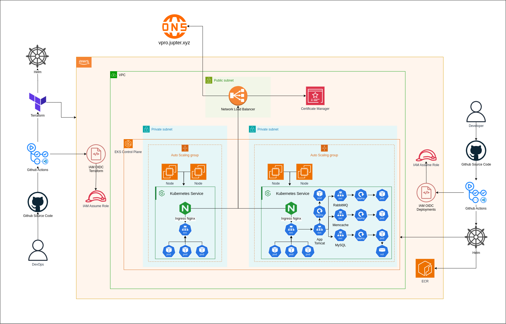

# The Infraestructure
The infraestructure belongs to this repository [vprofile-iac-terraform](https://github.com/davidlimacardoso/vprofile-iac-terraform).

Below the diagram of infraestructure AWS and Kubernets




# Helm

- Install deploys 
```bash
upgrade --install vprofileapp ./helm/vprofilecharts/ --set image.repository=xxxxxxxxx.dkr.ecr.us-east-1.amazonaws.com/vprofileapp --set image.tag=latest
```

- Uninstall deploys
```bash
helm uninstall vprofileapp ./helm/vprofilecharts/ 
```

# Tests

- Test frontend app
```bahs
kubectl port-forward pod/vproapp-6fdcffdcb5-ptbc9 8000:8080
```

# Logs 
- Show pod logs
```bahs
kubectl logs pod/vproapp-5d47cddcd-wnpd5
```

# DNS App

The domain app stay in ingress config `./helm/vprofilecharts/templates/vproingress.yaml` the `*.jupter.xyz` is configured in [vprofile-iac-terraform](https://github.com/davidlimacardoso/vprofile-iac-terraform) repository.

Extract DNS 

```bash
kubectl get ingress vpro-ingress
```


# Prerequisites
#####
- JDK 11
- Maven 3
- MySQL 8 

# Technologies 
- Spring MVC
- Spring Security
- Spring Data JPA
- Maven
- JSP
- MySQL
# Database
Here,we used Mysql DB 
MSQL DB Installation Steps for Linux ubuntu 14.04:
- $ sudo apt-get update
- $ sudo apt-get install mysql-server

Then look for the file :
- /src/main/resources/db_backup.sql
- db_backup.sql file is a mysql dump file.we have to import this dump to mysql db server
- > mysql -u <user_name> -p accounts < db_backup.sql
